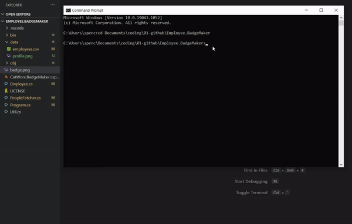

# Employee Badge Maker


## Description
A .NET command line application for making employee access cards. This application is written in C# programming language.

## Table of Contents
* [Links](#links)
* [Animation](#animation) 
* [Instructions](#instructions)    
* [APIs](#apis) 
* [License](#license)
* [Contribute](#contribute)
* [Contact](#contact)

## Links

Repository: [https://github.com/spencercreer/Employee.BadgeMaker](https://github.com/spencercreer/Employee.BadgeMaker)


## Animation
The following animation demonstrates the application functionality:
<br>


## Instructions
Enter the following in the Command Prompt to run the application:
```
dotnet run
```

## APIs 
The application utilizes the following APIs:
* [Random User API](https://randomuser.me/)

## License
This project is licensed under the MIT license.

## Contribute
Please submit a PR if you would like to contribute.

## Contact
For questions or comments, please contact me.

Email: <a href="mailto: spencercreer@gmail.com" target="_blank">spencercreer@gmail.com</a>

GitHub: [spencercreer](https://github.com/spencercreer/)
